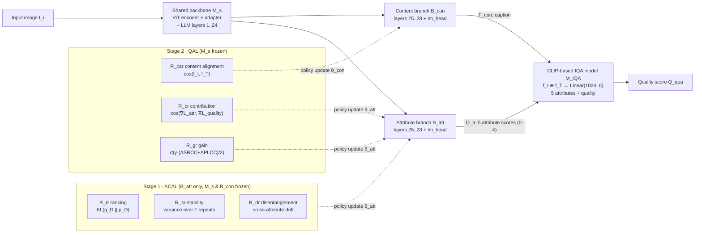

<div align="center">

# ACQA

### Attribute-Calibrated and Quality-Aware Vision-Language Learning for Image Quality Assessment

**Anonymous authors** · *Under review as a conference paper at ICLR 2027*

[](https://github.com/dart-into/ACQA)
[](LICENSE)
[](https://www.python.org/)
[](https://pytorch.org/)
[](https://huggingface.co/Qwen/Qwen2.5-VL-7B-Instruct)
[](#contributing)

A dual-branch VLM framework that goes **beyond score-only supervision** for blind image quality assessment (IQA).
ACQA calibrates *how* a VLM perceives quality-aware attributes across scenarios (ACAL), then aligns those
attributes and content descriptions with the quality regression target (QAL).

**Average SRCC 0.887 / PLCC 0.907** across LIVEC, TID2013, AGIQA-3k and AGIQA-20k — outperforming 15
hand-crafted, deep-learning and VLM-based baselines on every reported dataset.

<!-- TODO: replace with the real framework figure, e.g. assets/framework.png (Figure 2 of the paper) -->

</div>

---

## 🔥 News

- **[2026-XX]** Initial public release: reference implementation of the dual-branch VLM, ACAL and QAL stages.
- **[2026-XX]** Paper submitted to ICLR 2027.

> ⚠️ **Double-blind notice.** This manuscript is under double-blind review. Until a decision is made, please
> use an anonymized mirror (e.g. [anonymous.4open.science](https://anonymous.4open.science)) for any link
> placed inside the submitted PDF, and keep author-identifying metadata out of the public repository
> (commit history, `git config user`, funding acknowledgements, Hugging Face org name).

---

## ✨ Highlights

- **Dual-branch VLM, not two models.** A single Qwen2.5-VL-7B backbone is bifurcated after layer 24 into a
  *content branch* (caption generation) and an *attribute branch* (5 discrete attribute scores), so semantic
  reasoning and quality perception are decoupled without duplicating the visual encoder.
- **ACAL — attribute calibration via reinforcement learning.** Three rewards jointly shape the attribute
  branch: **ranking** (do scores order synthetic distortion levels correctly?), **stability** (do repeated
  inferences agree?) and **disentanglement** (does perturbing one attribute leak into the others?).
- **QAL — quality-aware analysis learning.** Bridges the generative process and the regression target through
  **content alignment** (CLIP cosine similarity between image and generated caption), **contribution**
  (gradient-direction cosine between each attribute head and the quality head) and **gain** (actual
  Δ SRCC / Δ PLCC achieved after re-fitting the IQA head).
- **Label-efficient IQA head.** The CLIP-based scorer trains a single `Linear(1024 → 6)` fusion head, keeping
  the 7B VLM update cost confined to a few LoRA-scale branch layers.
- **Scenario-robust.** Gains are largest exactly where fixed-attribute methods break down — AI-generated
  imagery (+4.0 SRCC / +4.5 PLCC on AGIQA-3k over the runner-up).

---

## 🧭 Method Overview



### Three-stage pipeline

| Stage | What is trained | What is frozen | Objective |
|---|---|---|---|
| **0 · Dual-branch VLM** | — (construction) | — | Split Qwen2.5-VL after `shared_llm_layers` into content / attribute branches |
| **1 · ACAL** | `attr_layers`, `attr_head`, `norm_a` | visual encoder, shared layers, content branch | Maximize `w_rr·R_rr + w_sr·R_sr + w_dr·R_dr` |
| **2 · QAL** | IQA head (`L_1 + L_2`), then content branch (`R_car`) and attribute branch (`R_cr`, `R_gr`) | shared backbone `M_s` | Align semantics + attribute contributions with MOS |
| **3 · Final fit** | IQA head only | whole VLM | Re-train `M_IQA` on refined captions & attribute scores |

### Quality-aware attributes

The attribute branch scores five dimensions on an integer scale **0–4**
(`poor / fair / good / very good / excellent`), read out as the expectation over the digit-token
log-softmax:

| # | Paper (Fig. 2 / §3.1) | Code (`ATTR_NAMES`) | Probing distortion |
|---|---|---|---|
| 1 | contrast | `contrast` | `contrast` |
| 2 | brightness | `brightness` | `overexposure` |
| 3 | realism | `authenticity` | `color_shift` |
| 4 | saturation | `saturation` | `color_shift` |
| 5 | blur / clarity | `sharpness` | `blur` |

Synthetic distortions are generated on the fly (`SyntheticDistortion`) at 5 levels per type, which is what
gives the ranking reward its supervision signal — **no extra human annotation is required for ACAL**.

---

## 📦 Installation

```bash
git clone https://github.com/dart-into/ACQA.git
cd ACQA

conda create -n acqa python=3.10 -y
conda activate acqa

# CUDA 12.1 build; adjust the index URL to match your driver
pip install torch==2.4.1 torchvision==0.19.1 --index-url https://download.pytorch.org/whl/cu121

pip install -r requirements.txt
```

`requirements.txt`:

```text
transformers>=4.49.0        # Qwen2_5_VLForConditionalGeneration requires >= 4.49
accelerate>=0.34.0
open_clip_torch>=2.24.0
qwen-vl-utils>=0.0.8
pillow>=10.0.0
numpy>=1.24
scipy>=1.10                 # SRCC / PLCC
tqdm
```

### Model weights

| Role | Model | Source |
|---|---|---|
| Dual-branch VLM backbone | `Qwen/Qwen2.5-VL-7B-Instruct` | [Hugging Face](https://huggingface.co/Qwen/Qwen2.5-VL-7B-Instruct) |
| IQA image / text encoder | `ViT-B-32` (OpenAI pretrained) | auto-downloaded by `open_clip` |

```bash
huggingface-cli download Qwen/Qwen2.5-VL-7B-Instruct --local-dir ./pretrained/qwen2.5-vl-7b-instruct
```

Then set `Config.vlm_name` (or `export ACQA_VLM_NAME=...`) to the local path for offline runs.

> **VRAM.** The reference implementation loads the backbone in `float32` and briefly holds a second full copy
> of the model to extract `embed_tokens`. Plan for **≥ 60 GB** as-is; switching to `bfloat16` and reusing the
> embedding matrix from the already-constructed model brings this within 2× 24 GB. See
> [Known limitations](#-known-limitations--todo).

---

## 🗂️ Data Preparation

ACQA is evaluated on six public IQA benchmarks:

| Type | Dataset | Images | Paper |
|---|---|---|---|
| Synthetic distortion | **KADID-10k** | 10,125 | [Lin et al., QoMEX 2019] |
| Synthetic distortion | **TID2013** | 3,000 | [Ponomarenko et al., EUVIP 2013] |
| Authentic distortion | **LIVEC** | 1,162 | [Ghadiyaram & Bovik, TIP 2015] |
| Authentic distortion | **BID** | 586 | [Ciancio et al., TIP 2010] |
| AI-generated | **AGIQA-3k** | 2,982 | [Li et al., TCSVT 2023] |
| AI-generated | **AGIQA-20k** | 20,000 | [Li et al., CVPR 2024] |

Each dataset should be laid out as a flat image folder plus a two-column CSV label file:

```text
data/AGIQA-3k/
├── label.csv          # <image_filename>,<MOS>   (header optional, auto-detected)
├── ai_0001.jpg
├── ai_0002.jpg
└── ...
```

`label.csv` example:

```csv
ai_0001.jpg,3.52
ai_0002.jpg,2.73
```

- Column 1 is either an absolute path or a filename relative to `data_root`.
- Column 2 is the raw MOS. Values are **min–max normalized to [0, 1]** at load time and rescaled to `[0, 4]`
  inside the IQA head, so any native MOS range works.
- Rows whose image file is missing are skipped with a warning.

Point the config at your data:

```python
cfg = Config(
    data_root="./data/AGIQA-3k",
    label_csv="./data/AGIQA-3k/label.csv",
    val_ratio=0.1,          # random held-out split, seeded by cfg.seed
)
```

> The train / validation split is a seeded random shuffle (`seed=42`), not the official benchmark split.
> For numbers comparable to Table 1 of the paper, use each dataset's published protocol.

---

## 🚀 Usage

### Full training (Stages 0 → 3)

```bash
python model_master.py
```

The script runs end to end and prints progress per stage:

```text
[data] train 2683   299 num
== Stage 0: dual branch VLM ==
== Stage 1: ACAL  ==
[ACAL] epoch 1/2  avg_reward=0.7318
== Stage 2: QAL  ==
[QAL/R_gr]  alignment  reward = 0.2841
[IQA] epoch 1/30  loss=8.4412
[QAL] IQA conrv : SRCC=0.8124 PLCC=0.8390
[QAL/R_ar] SRCC 0.8124->0.8573  PLCC 0.8390->0.8712  gain=+0.0386
== Stage 3: test quality score ==
final model: SRCC=0.8810  PLCC=0.9150
saved  acqa_checkpoint.pt
```

### Stage-by-stage

Each stage is an independent class, so they can be run or debugged separately:

```python
from model_master import Config, DualBranchVLM, AttributeCalibrationRL, QualityAwareLearning, FinalQualityScorer

cfg = Config()

# Stage 0 — build the dual-branch VLM
vlm = DualBranchVLM(cfg).to(cfg.device)   # retains the base embed_tokens itself

# Stage 1 — attribute calibration (ACAL)
AttributeCalibrationRL(vlm, cfg).train(rank_loader, eval_images, pil_fn)

# Stage 2 — quality-aware learning (QAL)
iqa = QualityAwareLearning(vlm, cfg).run(train_loader, val_loader, pil_fn=to_pil)

# Stage 3 — final IQA head fit + scoring
scorer = FinalQualityScorer(vlm, iqa, cfg)
scorer.retrain_final(train_loader, epochs=cfg.iqa_epochs)
out = scorer.score(pil_images)
```

### Inference

`FinalQualityScorer.score()` returns everything the paper's qualitative figures show — the quality score,
the five calibrated attribute scores and the content description:

```python
results = scorer.score([Image.open("demo.jpg").convert("RGB")])

results["quality"]      # np.ndarray [N]     — quality on the 0..4 scale
results["attributes"]   # np.ndarray [N, 5]  — contrast / brightness / authenticity / saturation / sharpness
results["captions"]     # List[str]          — content description from B_con
```

### Checkpoint layout

`acqa_checkpoint.pt` stores **only the trained deltas** — the shared backbone stays on Hugging Face weights:

```python
{
  "vlm_attr":         <state_dict of attr_layers>,      # B_att, layers 25..28
  "vlm_attr_head":    <state_dict of attr_head>,        # B_att lm_head
  "vlm_attr_norm":    <state_dict of norm_a>,           # B_att final norm
  "vlm_content":      <state_dict of content_layers>,   # B_con, layers 25..28
  "vlm_content_head": <state_dict of content_head>,     # B_con lm_head
  "vlm_content_norm": <state_dict of norm_c>,           # B_con final norm
  "iqa_head":         <state_dict of M_IQA head>,       # Linear(1024, 6)
  "config":           <asdict(cfg)>,                    # exact hyperparameters used
  "metrics":          {"srcc": ..., "plcc": ...},       # val scores of this checkpoint
}
```

Use the paired helpers rather than raw `torch.save` / `torch.load`:

```python
from model_master import save_checkpoint, load_checkpoint, CKPT_MODULES

save_checkpoint("acqa_checkpoint.pt", vlm, iqa, cfg, metrics={"srcc": s, "plcc": p})

# ... later, after rebuilding DualBranchVLM / CLIPIQAModel from the same base weights:
load_checkpoint("acqa_checkpoint.pt", vlm, iqa, strict=True)
```

Every submodule that Stage 2 puts into an optimizer is covered — `CKPT_MODULES` is the single source of
truth, so adding a newly trained module there automatically extends both save and load.

---

## ⚙️ Configuration Reference

All hyperparameters live in the `Config` dataclass at the top of `model_master.py`.

<details>
<summary><b>Full table (click to expand)</b></summary>

| Group | Key | Default | Meaning |
|---|---|---|---|
| Data | `data_root` | — | image folder root |
| | `label_csv` | — | `<filename>,<MOS>` label file |
| | `val_ratio` | `0.1` | held-out fraction (seeded split) |
| Model | `vlm_name` | `Qwen/Qwen2.5-VL-7B-Instruct` | dual-branch VLM base |
| | `clip_name` / `clip_pretrained` | `ViT-B-32` / `openai` | `M_IQA` encoders |
| | `shared_llm_layers` | `24` | split point — layers `[:24]` shared, `[24:]` duplicated per branch |
| | `clip_feat_dim` | `512` | `f_I` / `f_T` width → head input `2×512` |
| ACAL | `acal_lr` | `1e-6` | AdamW lr for `θ_att` |
| | `acal_epochs` | `2` | ACAL passes over the distortion-rank loader |
| | `acal_batch_size` | `2` | ranking batch |
| | `n_repeat_score` | `5` | `T` in the stability reward (Eq. 6) |
| | `w_rr` / `w_sr` / `w_dr` | `1.0 / 0.5 / 0.5` | reward weights |
| | `acal_baseline_ema` | `0.9` | EMA decay of the REINFORCE baseline |
| QAL | `iqa_lr` / `iqa_epochs` / `iqa_batch_size` | `1e-4 / 30 / 32` | `M_IQA` head fitting (`L_1 + L_2`) |
| | `qal_lr` | `1e-6` | AdamW lr for `θ_con` and `θ_att` policy updates |
| | `qal_epochs` | `2` | QAL passes |
| | `w_gr` / `w_cr` / `w_ar` | `1.0 / 1.0 / 1.0` | content-alignment / contribution / gain reward weights |
| Misc | `seed` | `42` | global RNG seed |
| | `max_caption_tokens` | `64` | *(reserved — see Known limitations)* |
| | `device` | `cuda` if available | — |

</details>

### Paper ↔ code map

| Paper symbol | Equation | Code |
|---|---|---|
| `M_vlm` | — | `DualBranchVLM` |
| `M_s` (shared backbone) | — | `.visual` + `.shared_layers` |
| `B_con` | Eq. 1 | `.content_layers` / `.norm_c` / `.content_head` |
| `B_att` | Eq. 2 | `.attr_layers` / `.norm_a` / `.attr_head` |
| `M_IQA` | — | `CLIPIQAModel` |
| `f_I`, `f_T` | Eq. 10 | `.encode_image()`, `.encode_text()` |
| `R_rr` ranking reward | Eq. 3–5 | `AttributeCalibrationRL.rank_reward` |
| `R_sr` stability reward | Eq. 6 | `AttributeCalibrationRL.stability_reward` |
| `R_dr` disentanglement reward | Eq. 9 | `AttributeCalibrationRL.disentanglement_reward` |
| ACAL policy update | Eq. 7–8, Alg. 1 | `AttributeCalibrationRL.train` |
| `R_car` content alignment | Eq. 10 | `QualityAwareLearning.content_alignment_step` |
| `L_1` (quality MSE) | Eq. 11 | `train_iqa` → variable `l2` ⚠️ |
| `L_2` (attribute MSE) | Eq. 12 | `train_iqa` → variable `l1` ⚠️ |
| `R_cr` contribution reward | Eq. 13 | `QualityAwareLearning.attribute_contribution_reward` |
| `R_gr` gain reward | Eq. 14 | `QualityAwareLearning.attribute_gain_reward` |
| Synthetic distortions `D_d`, levels `l` | §3.2 | `SyntheticDistortion`, `DistortionRankDataset` |
| SRCC / PLCC | §4.1 | `srcc()`, `plcc()` |

> ⚠️ The `l1` / `l2` local variable names inside `train_iqa` are swapped with respect to the paper's
> `L_1` / `L_2`. `cfg.w_l1` weights the **attribute** loss (paper `L_2`), `cfg.w_l2` weights the
> **quality** loss (paper `L_1`).

---

## 📊 Results

### Main comparison (Table 1 of the paper)

SRCC / PLCC. Best in **bold**, second best underlined. Baseline numbers are taken from their respective
original publications.

| Category | Method (year) | LIVEC | TID2013 | AGIQA-3k | AGIQA-20k | **Average** |
|---|---|---|---|---|---|---|
| Hand-crafted | BRISQUE (2012) | 0.629 / 0.629 | 0.626 / 0.571 | 0.473 / 0.556 | 0.431 / 0.459 | 0.539 / 0.553 |
| | NIQE (2012) | 0.594 / 0.589 | 0.521 / 0.648 | 0.405 / 0.462 | 0.421 / 0.439 | 0.485 / 0.534 |
| | ILNIQE (2019) | 0.508 / 0.508 | 0.521 / 0.648 | 0.490 / 0.553 | 0.526 / 0.541 | 0.511 / 0.562 |
| Classic DL | MUSIQ (2021) | 0.702 / 0.746 | 0.773 / 0.815 | 0.764 / 0.812 | 0.793 / 0.805 | 0.758 / 0.794 |
| | DBCNN (2023) | 0.851 / 0.869 | 0.816 / 0.865 | 0.820 / 0.875 | 0.836 / 0.849 | 0.830 / 0.864 |
| | Re-IQA (2023) | 0.840 / 0.854 | 0.804 / 0.861 | 0.832 / 0.853 | 0.842 / 0.869 | 0.829 / 0.859 |
| | MCOLE (2024) | 0.812 / 0.831 | 0.895 / 0.905 | 0.845 / 0.871 | 0.819 / 0.805 | 0.842 / 0.853 |
| | DGQA (2024) | 0.782 / 0.807 | 0.857 / 0.852 | 0.763 / 0.811 | 0.774 / 0.780 | 0.794 / 0.812 |
| | GDCIQA (2026) | 0.829 / 0.841 | 0.860 / 0.869 | 0.847 / 0.872 | 0.813 / 0.832 | 0.837 / 0.853 |
| VLM-based | Q-Align (2024) | 0.865 / 0.873 | 0.859 / 0.845 | 0.723 / 0.786 | 0.749 / 0.757 | 0.799 / 0.815 |
| | VQ-R1 (2025) | 0.750 / 0.794 | 0.829 / 0.841 | 0.783 / 0.849 | 0.726 / 0.720 | 0.772 / 0.801 |
| | EvoQuality (2026) | 0.813 / 0.847 | 0.611 / 0.674 | 0.831 / 0.771 | 0.806 / 0.827 | 0.765 / 0.779 |
| | Refine-IQA-S2 (2026) | 0.870 / 0.892 | 0.739 / 0.760 | 0.798 / 0.841 | 0.817 / 0.826 | 0.806 / 0.829 |
| | RALI (2026) | 0.876 / 0.896 | 0.817 / 0.844 | 0.715 / 0.779 | 0.726 / 0.742 | 0.783 / 0.815 |
| | Q-Insight (2026) | 0.865 / 0.893 | 0.822 / 0.831 | 0.764 / 0.811 | 0.718 / 0.729 | 0.792 / 0.816 |
| | **ACQA (ours)** | **0.890 / 0.914** | **0.903 / 0.928** | **0.881 / 0.915** | **0.876 / 0.862** | **0.887 / 0.907** |

### Ablations

**Dual-branch VLM** (Table 2, SRCC / PLCC):

| Content branch | Attribute branch | LIVEC | AGIQA-3k | Gaussian blur | Darken | Color shift |
|:---:|:---:|---|---|---|---|---|
| ✗ | ✗ | 0.802 / 0.839 | 0.814 / 0.856 | 0.869 / 0.872 | 0.886 / 0.728 | 0.845 / 0.862 |
| ✓ | ✗ | 0.849 / 0.852 | 0.845 / 0.878 | 0.882 / 0.895 | 0.904 / 0.913 | 0.852 / 0.875 |
| ✗ | ✓ | 0.843 / 0.849 | 0.850 / 0.895 | 0.892 / 0.898 | 0.895 / 0.901 | 0.871 / 0.880 |
| ✓ | ✓ | **0.890 / 0.914** | **0.881 / 0.915** | **0.897 / 0.916** | **0.910 / 0.925** | **0.908 / 0.892** |

Adding the dual branches improves over the no-VLM baseline by **+8.23 %** on average.

**ACAL / QAL rewards** (Table 3, selected rows, SRCC / PLCC):

| `R_rr` | `R_sr` | `R_dr` | `R_cr` | `R_gr` | `R_car` | LIVEC | AGIQA-3k |
|:---:|:---:|:---:|:---:|:---:|:---:|---|---|
| ✗ | ✗ | ✗ | ✗ | ✗ | ✗ | 0.792 / 0.785 | 0.803 / 0.844 |
| ✓ | ✗ | ✗ | ✗ | ✗ | ✗ | 0.853 / 0.853 | 0.849 / 0.893 |
| ✗ | ✗ | ✗ | ✓ | ✓ | ✗ | 0.863 / 0.871 | 0.864 / 0.904 |
| ✓ | ✓ | ✓ | ✗ | ✗ | ✗ | 0.874 / 0.881 | 0.870 / 0.902 |
| ✓ | ✓ | ✓ | ✓ | ✓ | ✓ | **0.890 / 0.914** | **0.881 / 0.915** |

ACAL alone and QAL alone improve over the frozen-VLM baseline by **+8.34 %** and **+8.59 %** respectively.

### Training behaviour

Reward curves over 50 epochs on TID2013 (paper Fig. 3) show ACAL rewards decaying towards a stable baseline
and QAL rewards rising before plateauing; after ACAL + QAL, content similarity and all five attribute
accuracies improve, and the mean attribute contribution to quality rises by **0.28 on KADID** and **68.5 %**
on average across the other datasets.

---

## 🧪 Reproduction Notes

Reported settings from §4.1 of the paper:

- 224 × 224 random crop + flip for the IQA model; **whole images** for the VLM branch.
- Reinforcement-learning batch size **4**.
- Learning rate **1e-5**, multiplied by **0.8 every 10 epochs**.
- Trained on **2× NVIDIA RTX 4090**, PyTorch.

> **Version note.** Qwen2.5-VL support landed in `transformers 4.49`, which requires a PyTorch release
> considerably newer than the one cited in the manuscript. Use `torch >= 2.1`; the `1.12` figure in the paper
> refers to the earlier CLIP-only prototype.

The defaults in `Config` are the values used by the released reference script and differ from the paper in a
few places (notably `acal_lr = qal_lr = 1e-6`, `iqa_lr = 1e-4`, `acal_batch_size = 2`, and no LR scheduler).
Override them explicitly when reproducing Table 1.

---

## 🚧 Known Limitations & TODO

This release is a **reference implementation** intended to document the method.

### Fixed in the current revision

- [x] **ACAL policy gradient.** The computed `advantage` was never multiplied into the loss, so the update
      carried no reward signal at all. Now a correct REINFORCE objective
      `-(A · log π) / B`; verified by a unit test asserting that a zero reward yields an exactly-zero
      gradient and that the gradient scales linearly with the advantage.
- [x] **Autograd crash in the attribute probe.** `_single_attr_probe_update` was decorated with
      `@torch.no_grad()`, which made its internal `torch.autograd.grad` raise on every batch. The decorator
      is removed, and the in-place weight mutation is deferred until *after* `optimizer.step()` so it can no
      longer invalidate the pending backward graph.
- [x] **Decoder-layer call signature.** `_forward_branch` passed the raw 2D padding mask and a `position_ids`
      that the processor never emits. It now builds the 3D M-RoPE index via `get_rope_index`, the 4D causal
      mask via `_update_causal_mask`, and forwards `position_embeddings` + `cache_position` exactly as
      `Qwen2_5_VLModel.forward` does — without these, every layer raises `AttributeError` on
      `transformers >= 4.49`.
- [x] **Stage-3 wiring.** `scorer = scorer.retrain_final(...)` rebound `scorer` to an object with no
      `.score()`; and the reported final SRCC/PLCC came from a freshly-initialized `CLIPIQAModel`. Fixed via
      `retrain_final() -> self`, a new `FinalQualityScorer.evaluate()`, and an injectable
      `QualityAwareLearning(vlm, cfg, iqa=...)`.
- [x] **Checkpoint completeness.** `attr_head`, `norm_a`, `content_head` and `norm_c` are optimized in
      Stage 2 but were not saved. Added `save_checkpoint` / `load_checkpoint` driven by a single
      `CKPT_MODULES` table, plus persisted `config` and `metrics`.
- [x] **CLIP text-encoder device.** `encode_text` fed CPU token ids into a CUDA model.
- [x] **Peak memory.** `main()` loaded a *second* full copy of the 7B weights purely to obtain
      `embed_tokens`. The embedding matrix is now retained from the first load and the duplicated tail
      layers are released.
- [x] **Syntax.** An `IndentationError` and an unterminated f-string meant the file did not parse at all.
- [x] Gradient clipping now covers the same parameter set as the optimizer (`norm_a` was being stepped
      unclipped); leftover Chinese comments and garbled log strings removed.

### Still open

- [ ] **Policy objective.** The paper specifies clipped PPO with a KL regularizer and group-wise advantage
      normalization (Eq. 7–8); the code is still plain REINFORCE with an EMA baseline. Marked
      `TODO(paper Eq. 7-8)` at the loss.
- [ ] **Content description length.** `_greedy_decode_simple` decodes a *single* token, so captions are
      degenerate; `max_caption_tokens = 64` is unused. Needs a real autoregressive `generate()` loop.
- [ ] **`M_IQA` trainable layers.** The paper trains the last four layers of the CLIP image and text
      encoders; the code freezes both encoders entirely and trains only the `Linear(1024, 6)` head.
- [ ] **`R_dr` trigger.** The paper applies disentanglement only when one distortion ranks wrongly while the
      others rank correctly; the code applies it unconditionally. The entropy-descent probe itself
      (`_single_attr_probe_update`) is not described in the manuscript at all — formalize it or drop it.
- [ ] **`R_gr` / `R_rr` functional form.** Gain reward omits the sigmoid and temperature `γ` of Eq. 14;
      ranking reward returns `exp(−KL)` rather than the KL of Eq. 5, with the attenuation coefficient `α`
      hardcoded to 1.
- [ ] **Multi-dataset runner.** Only a single `label.csv` folder is supported; per-benchmark loaders for
      KADID / TID2013 / LIVEC / BID / AGIQA-20k are pending.
- [ ] **Repo split.** `model_master.py` → `acqa/{models,acal,qal,data,utils}.py`, plus `train.py`,
      `inference.py`, `evaluate.py`, `configs/*.yaml`.
- [ ] **Pretrained weights** for all six benchmarks, released via Hugging Face.
- [ ] Clean up: hardcoded `/home/user/...` default paths, dead `if False else img4` in the `blur` branch,
      missing LR scheduler (the paper cites ×0.8 every 10 epochs).

Contributions on any of these are very welcome — see [Contributing](#contributing).

### Verification status

The current revision passes `test_p0_fixes.py` (53 checks, CPU-only): module import, synthetic distortion
correctness, dataset contracts, the ACAL gradient properties above, checkpoint round-tripping, and static
conformance of `_forward_branch` against the installed `transformers` API.

**Not yet verified end to end.** A full training run additionally needs a CUDA device, the
Qwen2.5-VL-7B weights, `open_clip`, `torchvision`, `scipy` and an IQA dataset — none of which were available
in the environment where these fixes were made. Treat the VLM forward path as reviewed against the
`transformers` 4.51.3 source, not as executed.

---

## 📁 Repository Layout

Current release:

```text
ACQA/
├── README.md
├── LICENSE
├── requirements.txt
├── model_master.py        # end-to-end reference implementation (dual-branch VLM + ACAL + QAL + IQA head)
└── test_p0_fixes.py       # CPU-only smoke tests: distortions, ACAL gradient, checkpoint round-trip, API conformance
```

Planned:

```text
ACQA/
├── acqa/
│   ├── models/            # DualBranchVLM, CLIPIQAModel
│   ├── rewards/           # R_rr, R_sr, R_dr, R_car, R_cr, R_gr
│   ├── distortions.py     # SyntheticDistortion, DistortionRankDataset
│   └── data/              # per-benchmark loaders
├── configs/               # YAML configs, one per benchmark
├── tools/                 # train.py, inference.py, evaluate.py
└── assets/                # framework figure, qualitative examples
```

---

## 🤝 Contributing

Issues and pull requests are welcome. For substantial changes, please open an issue first to discuss the
approach.

Especially helpful right now:

1. A correct PPO/GRPO implementation of Eq. 7–8 to replace the REINFORCE stub.
2. Multi-token caption decoding for the content branch.
3. Per-benchmark data loaders and evaluation scripts matching the official protocols.
4. VRAM profiling / `bfloat16` + gradient-checkpointing recipe for single-GPU training.

## 📄 License

Released under the [MIT License](LICENSE).

The Qwen2.5-VL backbone is subject to the
[Qwen license](https://huggingface.co/Qwen/Qwen2.5-VL-7B-Instruct/blob/main/LICENSE);
OpenAI CLIP weights are subject to their own terms. Please review them before commercial use.
Third-party IQA benchmarks (KADID-10k, TID2013, LIVEC, BID, AGIQA-3k, AGIQA-20k) are **not** redistributed
here — obtain them from their original sources and respect their licenses.

## 🙏 Acknowledgements

Built on [Qwen2.5-VL](https://github.com/QwenLM/Qwen2.5-VL),
[OpenCLIP](https://github.com/mlfoundations/open_clip),
[Hugging Face Transformers](https://github.com/huggingface/transformers) and
[PyTorch](https://github.com/pytorch/pytorch).
We thank the authors of Q-Align, Q-Insight, VQ-R1, Refine-IQA, RALI and EvoQuality for establishing the
VLM-based IQA setting this work builds on.

## 📚 Citation

If you find ACQA useful for your research, please cite:

```bibtex
@inproceedings{anonymous2027acqa,
  title     = {Attribute-Calibrated and Quality-Aware Vision-Language Learning for Image Quality Assessment},
  author    = {Anonymous},
  booktitle = {International Conference on Learning Representations (ICLR)},
  year      = {2027},
  note      = {Under review}
}
```

<!-- TODO: replace with the camera-ready BibTeX (authors, venue, pages) after acceptance. -->

---

<div align="center">

**Anonymous authors** · ICLR 2027 submission ·
[Report a bug](https://github.com/dart-into/ACQA/issues) · [Request a feature](https://github.com/dart-into/ACQA/issues)

If this repository helps your research, consider giving it a ⭐

</div>
